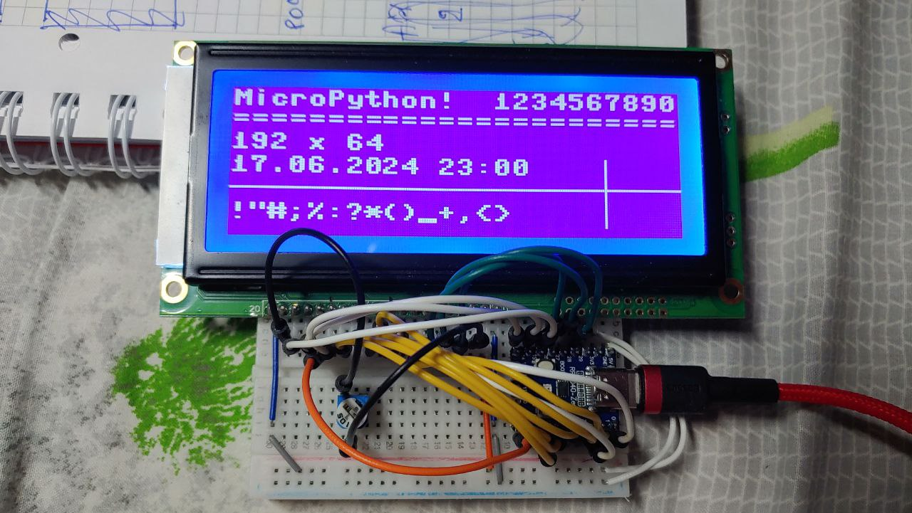

# micropython-lcd19264
Library for LCD 19264 display. Uses Framebuffer class. Sends data to display via Data bus.



**Pinout**
|N  | Name | Comments |
|---|------|------------------------------------|
|1  |	Vss |	GND
|2  |	Vdd	|	+5V
|3  |	Vo	|	Operating voltage for LCD
|4  |	RS	|	H:Data L:Command
|5  |	R/W	|	H:Read L:Write
|6  |	E		| Enable signal
|7  |	DB0	|	}
|...|	DB..|	} Data bus
|14 |	DB7	|	}
|15 |	CS1	|	Chip 1 selection L: Active
|16 | RST | Reset signal L: Active
|17 |	CS2	|	Chip 2 selection L: Active
|18 |	CS3	|	Chip 3 selection L: Active
|19 |	Vout|	-10v Out voltage for LCD driving
|20 |	LED+|	+5v LED backlight

3 and 19 pins are used to adjust the display contrast through a resistor.
I use a 1 Mega Ohm variable resistor. Acceptable contrast ~270kOm

**Code example:**

```python
# Works on Raspbery Pi Pico. For other controllers - check available pins!

from lcd19264 import LCD19264

lcd = LCD19264( rs = 1, rw = 2, en = 3, rst = 13, cs1 = 12, cs2 = 14, cs3 = 15,
                  db0 = 4, db1 = 5, db2 = 6, db3 = 7, db4 = 8, db5 = 9, db6 = 10, db7 = 11 )

lcd.text('MicroPython!  1234567890', 0, 1, 1)
lcd.show()
```
## File Structure:
* **lcd19264.py** - Main library LCD19264 ( Suitable for Esp32-family, RP2 )
* **lcd19264_rp2.py** - Main library LCD19264 ( Raspberry Pi Pico only ). Much faster than lcd19264.py
* **examples/** - a set of examples for using the library lcd19264
* **examples_rp2/** - a set of examples for using the library lcd19264_rp2
* **for_examples/** - files related to the examples
* **tools/font_to_py.py** - Used to convert ttf font to py-script. First of all, you need to install: `pip install freetype-py`. Then run a command similar to the example: `python font_to_py.py -x LibreBodoni-Bold.ttf 24 LibreBodoni24.py`. More details: https://github.com/peterhinch/micropython-font-to-py

## Display functions:
* **set_rotation ( rotation = True ):** - Change display orientation: True - 180 degrees, False - 0 degrees
* **set_font ( font ):** - Set font for text
* **set_text_wrap ( on = True ):** - Set text wrapping
* **draw_text ( text, x, y, color = 1 ):** - Draw text on display
* **draw_bitmap ( bitmap, x, y, color ):** - Draw a bitmap on display
* **load_bmp ( filename, x = 0, y = 0, color = 1 ):** - Load monochromatic BMP image on FrameBuffer
* **show ( ):** - Send FrameBuffer to lcd
* **other FrameBuffer functions** - see more on https://docs.micropython.org/en/latest/library/framebuf.html#module-framebuf

## Tools
* **tools / font_to_py.py** - Used to convert ttf font to py-script. First of all, you need to install: `pip install freetype-py`. Then run a command similar to the example: `python font_to_py.py -x LibreBodoni-Bold.ttf 24 LibreBodoni24.py`. More details: https://github.com/peterhinch/micropython-font-to-py
